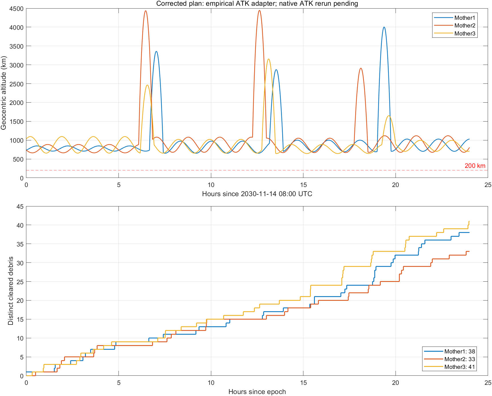

# ATK 差异定位与三母航天器修正方案

更新时间：2026-09-15。

已根据用户提供的 `ZPY15.xml`、三个接近分析报告和三个 J2000 位置速度序列重新计算 18 次机动。修正版在**经原 ATK 数据校准的离线模型**中清除 **112 个不同碎片**，三艘分别为 **38、33、41**，最低高度均高于 200 km。**尚未完成修正版的原生 ATK 复算，112 不是已确认的 ATK 成绩。**

原固定极轴模型得到的 113 个方案在 ATK 中不可行，应停止将其作为通过验证的提交方案。本次保留原场景、全部原轨道库、搜索结果和历史方案；仅另行提供修正场景。

## 1. 文件与使用方法

- [ZPY15_corrected.xml](../ZPY15_corrected.xml)：建议直接在 ATK 中打开的修正场景。
- [maneuvers.csv](../data/atk_correction/maneuvers.csv)：18 次修正脉冲，J2000 直角坐标，单位 m/s；`TimeSeconds` 从 2030-11-14 08:00:00 UTC 起算。
- [带 UTC 的机动表](../data/atk_correction/maneuvers_with_UTC.csv)：另附完整 UTC 时刻及脉冲模长，便于核对界面输入。
- [initial_states_J2000.csv](../data/atk_correction/initial_states_J2000.csv)：三艘的实际初始位置、速度，单位 m、m/s。
- [cleared_debris.csv](../data/atk_correction/cleared_debris.csv)：离线独立复核得到的 112 个碎片及首次满足约束的时间、距离和相对速度。
- [summary.json](../data/atk_correction/summary.json)：复核指标，明确标记 `NativeATKVerified=false`。

在 ATK 中打开修正 XML 后，分别进入 Mother1、Mother2、Mother3 的机动规划，点击**运行**，重新生成三艘星历；然后重新计算高级接近分析，最后运行“ZPY15 验证”。不要直接使用场景中的旧接近分析缓存。

修正 XML 仅替换三艘的 18 个 `Burn` 数值，并将母航天器的 `LastRunCode` 标记为未运行。初始状态、机动时刻、各预报段、J2000 脉冲坐标配置、碎片和其他场景内容保持原值。XML 中原保存的中间 `InitialState/FinalState` 仍是旧运行缓存，**必须运行后更新，不能当成修正后的预报结果**。自动检查已确认除脉冲和运行状态标记外，场景文本未变。

初始轨道沿用用户 XML 中的实际笛卡尔状态，未再次从六根数转换。这样避免软件引力常数不同造成二次转换差异。脉冲应直接导入，尽量保留全部有效数字。

## 2. 原结果的实际计数和高度问题

参考赛题使用说明中的高级接近分析口径：先筛选“接近期间最小相对速度”小于 **0.15 km/s**，再按碎片编号去重；接近记录本身已经满足距离小于 30 km。

| 航天器 | TXT 接近记录行数 | 接近的不同碎片 | 同时合格且去重的碎片 |
| --- | ---: | ---: | ---: |
| Mother1 | 17 | 16 | 13 |
| Mother2 | 14 | 13 | 13 |
| Mother3 | 25 | 21 | 14 |

前两艘合计 26 个，三艘合计 40 个。17、14、25 是接近记录数，不能直接作为最终清除数。逐个合格碎片编号见 [original_report_counts.json](../data/atk_correction/original_report_counts.json)。

截图报告 Mother3 在 **2030-11-15 04:58:39.86 UTC** 高度为 **92,117.876207 m**，已经不满足约束。新增轨迹序列进一步表明，后续约 **05:10:05.62 UTC** 的采样位置满足 `norm(r)-6378137 ≈ -593,469 m`。因此错误并非偶然采样或只越界数米，而是后段机动失配后的严重下降。负值表示数值轨道已进入参考地球内部，原方案不能提交。

## 3. 差异来源及证据

### 3.1 主要问题是动力学参考轴不一致

原 `model_rv` 的 J2 加速度始终以传入惯性坐标的 Z 轴为地球对称轴。ATK 的场景采用 EGM96、2 阶 0 次；安装目录 `AstroData/Earth/EarthReferenceSystem.xml` 配置为 ICRF→ECF 使用 IERS 2010/CIO，J2000→ECF 使用 IERS 1996。不能将 ATK 的该配置直接等同于原代码的固定惯性 Z 轴模型。

逐段从 XML 保存的实际初始状态重新积分，原模型对正常滑行段的端点位置差可达 **约 300～855 m**。仅替换引力常数和半径不能消除差异。将 J2 极轴改为与 ATK 结果相符的方向后，使用一个固定拟合极轴，21 段端点误差降到约 **0.2 mm～3.3 cm**。

进一步以任务起点为时间零点，采用极轴横向分量的二次时间多项式，使用 Mother1/2 的 14 个传播段拟合、Mother3 的 7 个传播段检查；Mother3 单段端点误差小于 **0.33 mm**。这是用于本场景当天的**经验适配模型**，不是 ATK 内核的完整重实现，也不应直接用于别的历元。

### 3.2 常数和脉冲坐标转换也有差异

| 参数 | 原计算 | 安装版及仓库 EGM96 文件 |
| --- | ---: | ---: |
| 引力常数 μ（m³/s²） | 3.986004418×10¹⁴ | 3.986004415×10¹⁴ |
| 重力场参考半径（m） | 6378137 | 6378136.3 |
| 归一化 C20 | −4.841653717360×10⁻⁴ | 相同 |

ATK 在 XML 中保存的机动前后状态属于 `Inertial`，输入的脉冲属于 `J2000`。实际速度增量与 J2000 分量存在毫米/秒量级的坐标转换差异，这本身不是用户输入错误。原脉冲表与输入 XML 的数值相符；不能把不同坐标系下的分量直接相减来认定输入错误。

坐标转换由 18 个已知脉冲及其机动前后速度估计，包含三艘数据；极轴拟合则只使用 Mother1/2 的传播段。两种拟合的用途和数据范围不同。

### 3.3 大脉冲使误差在后段迅速放大

原方案包含多次约 10 km/s 量级的速度反向或大幅调整。即使前段只产生很小的状态偏差，后续仍照搬原先计算的固定脉冲，也可能导致转移终点偏离、后段轨道逃逸或穿入地球。

提高积分精度不能修复不同动力学模型之间的系统差异。现有 `model_rv` 和原库保留用于复现历史搜索；新模型在 `atk_calibrated_dynamics.m` 中单独实现，避免将旧缓存误认为是在新模型下计算的。

## 4. 本次修正方法与复核

沿用原来选定的三艘初始轨道、四段组合及全部机动时刻；每次转移仍为 2700 s，每艘仍为 6 个脉冲。采用校准模型，从实际连续状态出发，逐段重新求解转移出发速度，再通过第二脉冲匹配目标速度。仅调整速度，不重置转移位置。

积分在 ATK `Inertial` 近似坐标中进行；初始状态和每次脉冲按对应时刻转换。判定清除时再转回 J2000，与保留的碎片轨迹库比较。检查包括全部 1 s 同步采样、脉冲前后状态及径向极值；碎片按三艘联合去重。

| 航天器 | 离线清除数 | 最低高度（km） | 脉冲数 |
| --- | ---: | ---: | ---: |
| Mother1 | 38 | 653.093 | 6 |
| Mother2 | 33 | 662.339 | 6 |
| Mother3 | 41 | 644.817 | 6 |
| 联合 | **112** | **644.817** | 18 |

这里高度按地心距离减 6378137 m 计算。实际提交应以 ATK 验证器的高度检查为准。

复核证据：

1. 使用原 XML 的初始状态和原脉冲进行完整连续回放，离线结果复现原 TXT 中的 **13、13、14 个完整合格编号集合**，联合 40 个，并复现 Mother3 的高度违规。
2. 与全部原 J2000 导出位置点比较，三艘全日最大位置差分别为 **26.23、31.28、316.47 m**。它们包含误差累积，不是拟合单段时强制重置状态的结果，也不是修正版未来误差的保证上界。
3. 修正版采用 `ode113` 完整回放，清除 112 个。实际导出的 XML 再由 `ode89` 独立回放，仍得到完全相同的 112 个编号集合；两次高度曲线最大差约 **13.95 m**。
4. XML 初始状态导出误差为 0；脉冲数值相对求解结果最大差约 **4.73×10⁻¹¹ m/s**。仅将脉冲舍入到小数点后 9 位，仍清除 112 个；舍入到 6 位则降至 108 个。这是输入精度试验，不是完整鲁棒性证明。
5. 通过 XML 修改范围检查、跨坐标系清除判定、无径向极值事件的高度检查，以及已有转移求解测试。



## 5. 复现步骤

在仓库根目录执行，需 MATLAB 和 Python，以及已有 `data/x_rv.mat`、`data/mission/best_mission.mat` 和用户新增的 ATK 数据。

```powershell
python src/audit_atk_xml.py
matlab -batch "addpath('src'); audit_atk_dynamics; diagnose_atk_pole; calibrate_atk_dynamics; correct_atk_plan; verify_atk_adapter"
python src/build_atk_corrected_xml.py
python src/audit_atk_xml.py ZPY15_corrected.xml data/atk_correction/corrected_segments.json
matlab -batch "addpath('src'); crosscheck_atk_correction; export_atk_correction_artifacts"
python tests/test_atk_xml_export.py
matlab -batch "addpath('tests'); test_mission_combination; test_j2_transfer"
```

诊断和复核数据保存在 `data/atk_correction/`。程序不会覆盖原轨道库和 `data/mission` 的历史方案。原生接口曾尝试连接，但没有取得修正版的有效复算结果，已停止该尝试；本文所有新成绩明确属于离线结果。

## 6. 下一步

请先在 ATK 中重跑修正 XML 并运行赛题验证器。若仍存在差异，提供新的三艘 J2000 位置速度序列、接近报告和运行后保存的 XML，即可继续逐段校正；导出速度尽量提高精度。

后续值得改进的方向是：在完整三艘组合优化中加入机动后状态误差放大程度和脉冲输入精度的评估，优先选择较不敏感的拼接，再比较清除数。这会涉及重新排序候选组合，应另行确定清除数量与误差容忍度的取舍。本次未重搜原库，也未将本方案宣称为全局最优。
