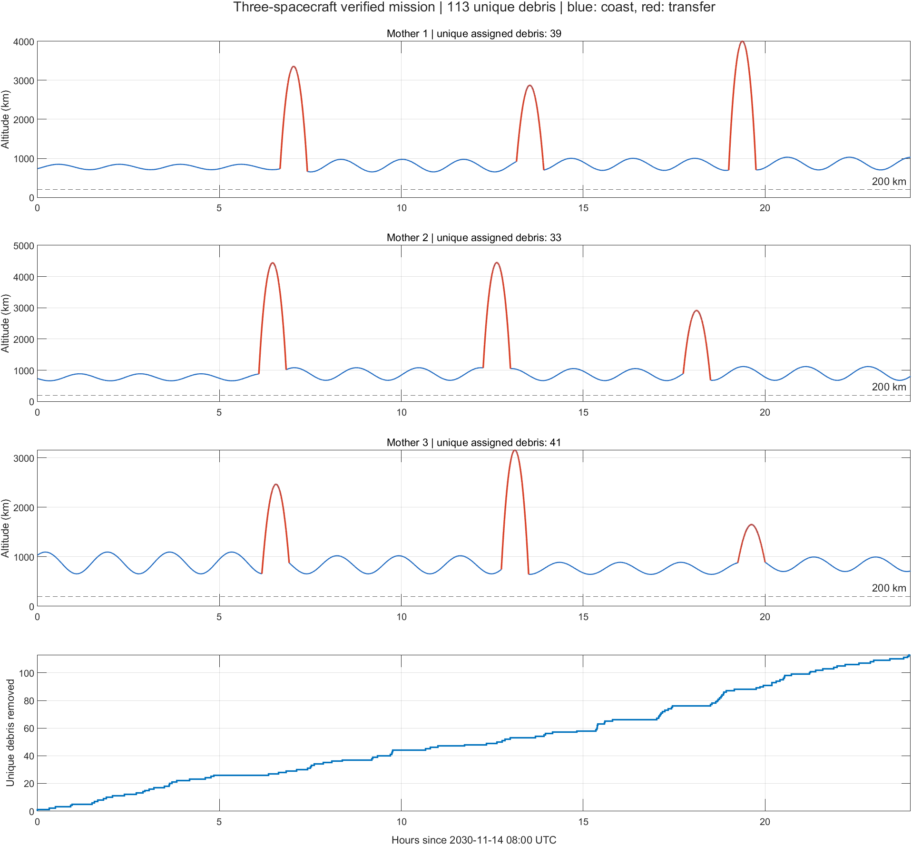

# 三母航天器组合优化与机动方案

> **2026-09-15 ATK 复核更新：下文 113 个是原固定极轴模型的历史结果，不是 ATK 可行成绩。** 用户提供的 ATK 结果表明原方案 Mother3 违反高度约束。已另行重新计算 18 次机动，离线校准模型复核为 112 个，原生 ATK 复算待完成。当前修正文件、差异原因和复算步骤见 [ATK 修正与复核说明](ATK修正与复核说明.md)。

本次搜索得到的最佳可行方案，在 1 s 同步采样与更严积分容差复核下，共清除 **113 个不同碎片**。三艘母航天器各使用 6 次脉冲，最低高度均不低于 200 km。该结果为已搜索候选中的最佳可行解，未证明连续轨道设计问题的全局最优。

任务历元和起点为 **2030-11-14 08:00:00 UTC**，终点为 **2030-11-15 08:00:00 UTC**。所有计算均使用 SI 与弧度；惯性系速度增量按 ECI 三轴给出。

## 1. 约束与目标

- 最多 3 艘母航天器，每艘不超过 6 次瞬时脉冲。
- 全程地心距离减去 6378137 m 不低于 200000 m。
- 同一采样时刻距离严格小于 30000 m，且相对速度严格小于 150 m/s 时清除。
- 跨时段和跨航天器统一去重，按首次接近归属；完全同时命中时按航天器编号固定归属，总数不受影响。
- 最大化不同碎片数量；相同数量时，已验证候选之间优先选择总速度增量较小的方案。赛题未设置速度增量上限，不另加限制。
- 竞赛提交时间奖励系数不用于本地搜索，因为本次没有实际竞赛提交时刻。

## 2. 原有库与补充搜索

原有 `data/preferred_orbit_library.mat` 和 `grid_search_result.mat` 保持不变，第一窗口原有 5 条清除数为 8 的轨道参与候选库合并。其余三个窗口使用原六维范围和粗步长，每窗完成 1296 次评分，结果如下。

| UTC 窗口 | 原网格最高分 | >5 细搜条件 | ≥8 入库 |
|---|---:|---|---:|
| 14:00–22:00 | 5 | 不满足，停止细搜 | 0 |
| 20:00–次日04:00 | 4 | 不满足，停止细搜 | 0 |
| 次日00:00–08:00 | 2 | 不满足，停止细搜 | 0 |

在不降低门槛的前提下，补充使用参考论文表 1 的 12 条轨道。论文正文写真近点角，表头写 M；两种解释分别复算，按真近点角转换后多数条目重现 9–14 的收益，按表头直接作为 M 则多数只有 0–6。两类种子均按实测评分处理，未把论文清除数作为评分。

真近点角 f 转为平近点角采用 `E=2 atan2(sqrt(1-e) sin(f/2),sqrt(1+e) cos(f/2))`、`M=E-e sin(E)`。对论文 12:00 和 17:00 起点的两条基元，用 `model_rv` 数值传播到本项目 14:00 和 20:00 起点，再提取根数；四个任务窗口始终按 README。

只有实测清除数 >5 的种子进入局部细化。每轮最多选 12 个种子，优先保留不同碎片覆盖集合；交替搜索 `[a,e,M]` 和 `[i,Omega,omega]` 的 3×3×3 局部网格，共四轮。首轮步长为 2000 m、0.001、0.25°，第二轮为 0.01°、0.02°、1°，第三、四轮各减半。所有已评分且 ≥8 的候选保留；不受种子数量限制。

| 窗口 | 补充实际评分数 | 补充入库数 | 补充最高分 | 高精度复核后组合库数 | 搜索耗时/s |
|---|---:|---:|---:|---:|---:|
| 08:00–16:00 | 1143 | 345 | 11 | 345 | 214.6 |
| 14:00–22:00 | 986 | 366 | 11 | 366 | 185.6 |
| 20:00–次日04:00 | 983 | 389 | 14 | 389 | 184.6 |
| 次日00:00–08:00 | 1028 | 423 | 11 | 423 | 192.7 |

## 3. 组合选择与时间细化

每个方案由 12 个轨道编号和 9 个转移时隙构成，即三艘船各选四段轨道、三段转移。转移时长固定为 2700 s，在相邻窗口重叠区内以 300 s 搜索出发时刻。第三、四窗口实际重叠 4 h，前两处各重叠 2 h，程序按实际边界生成时隙。

候选预处理保存每颗碎片的全部连续命中采样区间。滑行收益只取实际保留时段内的命中，扣除转移占用的基元部分，最后对三艘船取并集。初始组合评分不计转移中偶然清除；最终完整回放将其纳入。

遗传搜索使用种群 100、400 代、精英 8、逐基因变异概率 0.15、每代随机移民 10，配合单点交叉和三元锦标赛。固定随机种子为 1、7、23、47、89、131；每次搜索后做至多四轮单基因穷举改进。

| 随机种子 | 最佳基元滑行去重数 | 耗时/s |
|---:|---:|---:|
| 1 | 111 | 0.8 |
| 7 | 110 | 0.7 |
| 23 | 112 | 0.7 |
| 47 | 111 | 0.8 |
| 89 | 109 | 0.7 |
| 131 | 111 | 0.8 |

随后增加中性变异搜索：固定种子 20260913，24 次重启，每次 200 个随机基因的全取值扫描；在最高分取值中随机选取，允许同分变更，每次重启先随机扰动 2–6 个基因。以此跨越只接受严格改进时的平台，并对母船编号排列去重。补充搜索最高滑行评分 113，耗时 11.8 s；其排名前 8 个候选也完成拼接与回放。


选取排名前 12 个不同候选，每个同时尝试原始时隙和事件边界细化。固定轨道组合时，收益只在左段命中起点、右段命中终点减去转移时长等整数秒边界变化；按这些边界逐项优化，不把全部时间网格无差别加密。

## 4. 两脉冲转移与连续性

对相邻轨道先求两种零圈 Lambert 转移角分支，再使用 `ode113 + model_rv` 和有限差分射击修正初速度，要求到达位置误差 <0.01 m。首脉冲改变出发速度，末脉冲匹配下一基元速度；全过程保持位置连续，不把实际到达位置重置为理想位置。下一段从实际到达状态继续传播。

每个 Lambert 分支同时检查高度；不可行的分支不接受。在可行分支中选总速度增量较小者。该实现没有声称 45 min 对任意轨道均能转移，也未穷举多圈解。

## 5. 初始轨道和机动表

表中角度以度显示，实际 CSV 与 MAT 使用弧度。最后一列为**平近点角 M**，不能直接作为 ATK 真近点角输入。建议用 `initial_orbits.csv` 中的位置速度进行设置。

| 母船 | a/km | e | i/° | Omega/° | omega/° | M/° |
|---:|---:|---:|---:|---:|---:|---:|
| 1 | 7144.000000000 | 0.009000000000 | 98.090000000 | 75.820000000 | 40.000000000 | 62.778199796 |
| 2 | 7144.000000000 | 0.015000000000 | 98.210000000 | 75.800000000 | 20.000000000 | 287.448821239 |
| 3 | 7258.000000000 | 0.030000000000 | 98.055000000 | 75.450000000 | 50.000000000 | 133.677222529 |

完整精度初始状态见 [initial_orbits.csv](../data/mission/initial_orbits.csv)，四段基元见 [selected_segments.csv](../data/mission/selected_segments.csv)。

以下脉冲分量均为**地心惯性系 ECI**，单位 m/s；ATK 默认 VVLH 分量不能直接照填。需选择与本项目初始数据一致的惯性坐标系，或显式转换。每个奇数脉冲出发、随后偶数脉冲到达，相隔 45 min。

| 母船 | 脉冲 | UTC | Δvx | Δvy | Δvz | 模长 |
|---:|---:|---|---:|---:|---:|---:|
| 1 | 1 | 2030-11-14 14:40:00 | 3707.080660686 | 11512.662154143 | 5649.602538912 | 13349.226410 |
| 1 | 2 | 2030-11-14 15:25:00 | 1562.319255639 | -1535.809425280 | 13341.272411613 | 13519.951982 |
| 1 | 3 | 2030-11-14 21:10:00 | 1538.289058067 | -1704.815263457 | 13506.764584399 | 13700.562684 |
| 1 | 4 | 2030-11-14 21:55:00 | -2305.765310241 | -12704.539470137 | 5864.996130357 | 14181.680310 |
| 1 | 5 | 2030-11-15 03:00:00 | 3145.204549163 | 11264.186283384 | 2758.529653060 | 12015.976453 |
| 1 | 6 | 2030-11-15 03:45:00 | 1208.631267738 | -2085.513214995 | 11801.717938168 | 12045.360152 |
| 2 | 1 | 2030-11-14 14:05:00 | -296.595821473 | -5757.695770885 | 7769.437365074 | 9674.873986 |
| 2 | 2 | 2030-11-14 14:50:00 | -2558.247350567 | -6243.965657344 | -6847.494999929 | 9613.528198 |
| 2 | 3 | 2030-11-14 20:15:00 | -2379.950053179 | -9988.235092863 | 705.794170888 | 10292.091524 |
| 2 | 4 | 2030-11-14 21:00:00 | -1335.846290784 | 616.955948699 | -10214.966523995 | 10320.400237 |
| 2 | 5 | 2030-11-15 01:45:00 | 3077.224792288 | 5318.315947112 | 12238.879244267 | 13694.669112 |
| 2 | 6 | 2030-11-15 02:30:00 | -413.459075450 | -8445.972350224 | 11366.516332972 | 14166.971832 |
| 3 | 1 | 2030-11-14 14:10:00 | 1685.620218621 | 11600.273347061 | -8690.533020821 | 14592.224691 |
| 3 | 2 | 2030-11-14 14:55:00 | 3849.237171637 | 13020.956095879 | 3726.702651784 | 14080.136260 |
| 3 | 3 | 2030-11-14 20:45:00 | 3743.146951259 | 11827.504332399 | 5565.974732920 | 13597.098314 |
| 3 | 4 | 2030-11-14 21:30:00 | 1876.052742614 | -464.356901783 | 13689.791933829 | 13825.541740 |
| 3 | 5 | 2030-11-15 03:15:00 | -204.838991818 | -958.718728739 | 200.074143560 | 1000.564979 |
| 3 | 6 | 2030-11-15 04:00:00 | 100.293579232 | 730.957842895 | -530.991059593 | 909.015773 |

完整精度数据见 [maneuvers.csv](../data/mission/maneuvers.csv)。

## 6. 独立验证结果

回放仅输入各船初始位置速度和 6 个脉冲，不使用库内轨迹或拼接的中间状态。每个 1 s 同步采样点及脉冲前后均检查清除条件，滑行段和转移段全部参与。高度检查覆盖积分节点、端点以及通过事件函数定位的径向速度零点。

| 母船 | 首次清除归属数 | 含重复的可清除目标数 | 全程最低高度/km | 总 Δv/(m/s) | 最大拼接位置误差/m |
|---:|---:|---:|---:|---:|---:|
| 1 | 39 | 39 | 653.091877915 | 78812.757992 | 0.000382829051 |
| 2 | 33 | 33 | 662.342151649 | 67762.534889 | 0.000202372124 |
| 3 | 41 | 41 | 644.817404487 | 58004.581757 | 0.000238478619 |

本方案基元截断规划值为 113；全轨迹复核为 **113**。完整清除编号、首次时刻、归属母船以及同一时刻的距离/速度见 [cleared_debris.csv](../data/mission/cleared_debris.csv)。

对照实验仅使用论文种子与原有第一窗口库，不含新增局部网格，三个固定随机种子搜索并独立复核得到 108 个；本次最终结果比该对照多 5 个。差值同时包含候选扩充与组合搜索差异，不能全部归因于局部网格细化；两者均为有限搜索结果。

最终拼接与标准回放使用 ode113，相对容差 2e-13，位置/速度绝对容差 1e-8 m / 1e-11 m/s，最大步长 30 s；最终复核相对容差收紧至 3e-14，绝对容差 1e-9 m / 1e-12 m/s，最大步长 15 s。两次清除数为 113 / 113，首次采样时刻完全相同=0，高度曲线最大差 52.7823286 m。

数值敏感性检查发现：早期采用 ode45、2e-11 容差生成的大脉冲方案，在收紧到 2e-12 后，第一段约 4 mm 的位置积分差被后续多次脉冲放大，末端位置差可达约 261 km，清除数从 112 变为 105。该初步方案已废弃，最终脉冲使用高阶积分重新求解；不能只用同一积分设置自洽回放就认定结果可靠。两档高阶积分复核只证明当前采样清除集合的数值稳定性，不意味着脉冲执行误差不敏感。

另外，从导出的 CSV 重新读取初始状态和脉冲，改用独立高阶积分器 ode89 回放，清除集合完全一致，数量 113。CSV 与 MAT 的最大位置分量差 4.65661287e-09 m、速度分量差 3.63797881e-12 m/s、脉冲分量差 4.91127139e-11 m/s；ode89 与最终 ode113 高度曲线最大差 14.0430537 m。



## 7. 修复、测试与复现

修复 `rv2coe.m` 中径向速度对应真近点角的象限反向、赤道/极轨判断混淆和退化分支未赋返回值的问题，改用有向 atan2。测试覆盖 32 个合成轨道和全部 345 个 CSV 状态的往返转换。修复后从 CSV 用 `OE_scl_ptb` 重新计算全部碎片在 6 h 的状态，与现有 x_rv 的最大位置差约 0.032 mm；现有碎片文件未重写。

新增测试覆盖 Lambert 自然漂移、跨轨道两脉冲、高度约束、重复接近区间、三船去重、可证明最优值的合成组合问题以及四窗口连续拼接。执行：

```matlab
addpath('tests');
test_si_units; test_rv2coe_roundtrip; test_j2_transfer;
test_mission_combination; test_mission_assembly;
```

从仓库根目录运行完整流程（需要 MATLAB 与并行工具箱；真实碎片输入 `data/x_rv.mat` 为 6×345×86401，约 1.43 GB 未压缩）：

```matlab
addpath('src');
run_mission_library_search(0); % 原网格粗搜诊断
run_mission_library_search(2); % 执行严格 >5 的细搜规则
diagnose_reference_seeds;     % 两种角度解释分别核对
run_seeded_mission_search;    % 补充局部网格库
run_mission_combination;      % 联合优化、拼接、验证与导出
```

复现中性变异补充阶段及对照实验：

```matlab
run_reference_combination_baseline;
improve_mission_combinations;
finalize_mission_improvements;
crosscheck_mission_export;
```

窗口结果默认复用已有文件，不覆盖原有单窗口库。若更改搜索范围、动力学、数据或种子配置，应先将对应 `data/mission` 结果另存后再运行，避免复用旧结果。组合目录缓存还核对源库文件信息，源库变化时会要求重新生成缓存。随机搜索固定种子，结果和候选验证记录均保存。

仅复核已导出的方案，无需重新搜索：

```matlab
addpath('src');
global J_2 R_E mu
J_2=-sqrt(5)*(-4.841653717360e-4); R_E=6378137; mu=3.986004418e14;
s=load('data/mission/best_mission.mat','bestPlan');
d=load('data/x_rv.mat','x_rv');
v=verify_mission_plan(s.bestPlan,d.x_rv);
disp(v.Score); disp(v.MinimumAltitudes);
```

## 8. 结果边界与后续方向

- 当前结果通过本仓库动力学的数值复核，**尚未在 ATK 中验证或生成竞赛提交结果**。输入 ATK 后仍应使用“ZPY15 验证”检查。
- 计数为 1 s 采样结果，未定位所有采样间短于 1 s 的连续接近事件。
- 库中所有基元完整覆盖并集为 140 个目标，仅可用作库内滑行覆盖参考；因为转移段也能清除碎片，它不是整个轨道设计问题的全局上界。
- 局部网格、有限种群、坐标改进和两个零圈转移分支均未穷举全空间；未证明全局最优。
- 若继续提高数量，可扩大覆盖集合多样性、拓展新相位/半长轴种子，或允许调整窗口边界；应分别记录新增计算与收益。若希望降低速度增量，可在清除数不降低的条件下进一步优化转移时刻。

## 参考资料

1. [赛题：面向卫星解体碎片清除任务的轨道设计与机动规划](ref/第十五届全国大学生周培源力学竞赛—“空间轨道设计“团体赛题目.pdf)，动力学、评价指标与约束。
2. [唐子杰等：面向大规模空间碎片清除的轨道分段-拼接规划方法](ref/面向大规模空间碎片清除的轨道分段-拼接规划方法.pdf)，第 2 节与表 1。
3. [ATK 方案设计使用说明](ref/附件1：基于ATK软件的碎片清除轨道方案设计使用说明.docx)，初始状态、脉冲和坐标系设置。
